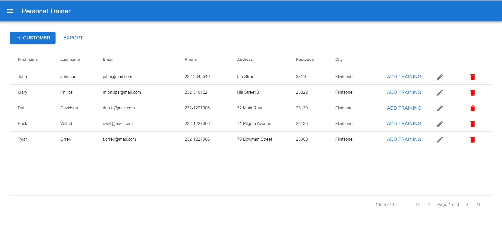
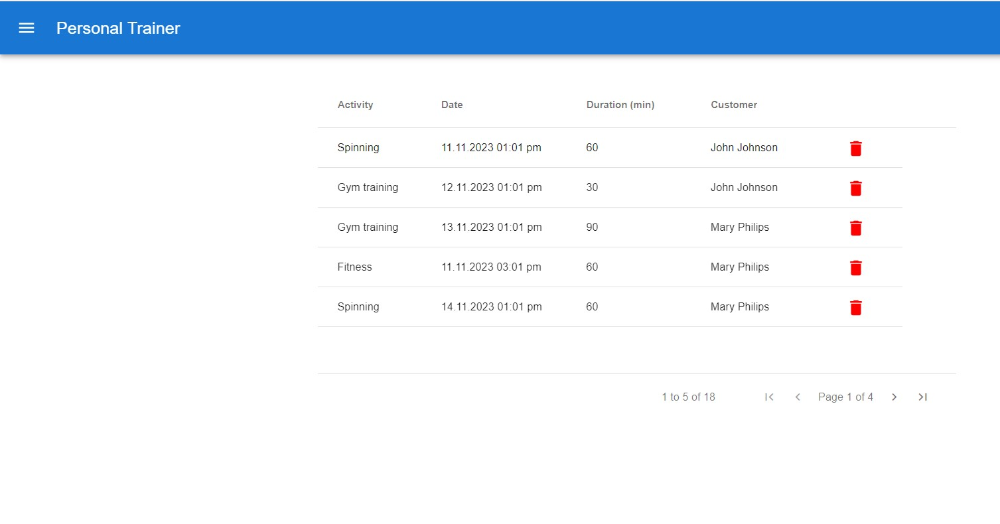
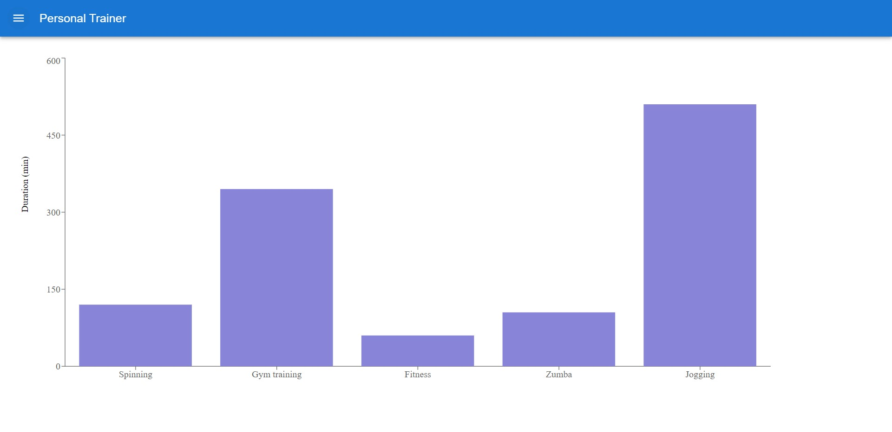
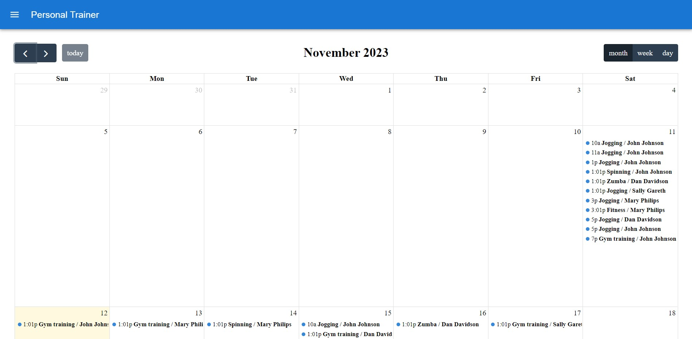

# Personal trainer

> Created as my final project for a university Front-end Programming course, the 'Personal Trainer' web app, built with React.js, simplifies customer and training management. It includes a Customer List for easy info access, Trainings List for quick removal of sessions, a Calendar for scheduling, and Statistics with clear diagrams showing total training durations.
> 
> You can find the final version of the application [_here_](https://personal-trainer-alex.netlify.app).

## Table of Contents
* [Usage Guied](#usage-guide)
* [Features](#features)
* [Technologies Used](#technologies-used)
* [Screenshots](#screenshots)

## Usage Guide
1. Clone the project <br>```git clone https://github.com/alexonthespot7/personalTrainer.git```<br>
2. run the following command in a terminal window (in the complete) directory:<br>
```npm install```<br>
3. run the following command in a terminal window (in the complete) directory:<br>
```npm start```<br>
4. Navigate to localhost:3000

## Features
- Customer List:
  - Displays a comprehensive list of customers.
  - Allows viewing and editing of customer details.
  - Supports the deletion of customer profiles.
  - Facilitates the addition of new training sessions for specific customers.

- Trainings List:
  - Presents a detailed overview of all training sessions.
  - Provides information about each training session.
  - Enables the removal of individual training sessions.

- Calendar:
  - Exhibits a visual representation of scheduled training sessions.
  - Integrates seamlessly with a calendar view for a holistic overview.

- Statistics:
  - Offers a visual summary of training statistics across all customers.

- User-Friendly Interface:
  - Features an intuitive and easy-to-navigate interface.
 
## Technologies Used
- React.js
- css

## Screenshots
<p align="center">
  
  
  
  
</p>
